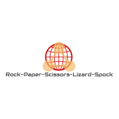

# Rock-Paper-Scissors-Lizard-Spock

[![Contributors][contributors-shield]][contributors-url]
[![Forks][forks-shield]][forks-url]
[![Stargazers][stars-shield]][stars-url]
[![Issues][issues-shield]][issues-url]
[![MIT License][license-shield]][license-url]
[![LinkedIn][linkedin-shield]][linkedin-url]

<br />
<p align="center">
  <a href="https://github.com/rodrigodalri/Rock-Paper-Scissors-Lizard-Spock">
    
  </a>

  <h3 align="center">Rock-Paper-Scissors-Lizard-Spock</h3>

  <p align="center">
    Rock-Paper-Scissors-Lizard-Spock is a hand game inspired by The Big Bang Theory TV show.
    <br />
    <a href="https://github.com/rodrigodalri/Rock-Paper-Scissors-Lizard-Spock"><strong>Explore the docs »</strong></a>
  </p>
</p>

## Table of Contents

* [About the Project](#about-the-project)
* [Getting Started](#getting-started)
  * [Prerequisites](#prerequisites)
  * [Installation](#installation)
* [Usage](#usage)
* [Roadmap](#roadmap)
* [Contributing](#contributing)
* [License](#license)
* [References](#references)
* [Authors](#Authors)

## About the Project
This is a simple implementation of the hand game inspired by the TV Show The Big Bang Theory.

## Getting Started
To get a local copy up and running follow these simple example steps.

<!-- Atualizar -->
### Prerequisites
This is an example of how to list things you need to use the software and how to install them.
* Python 3.7 or greater
```sh
apt-get install python3
```

### Installation
1. Clone the repo
```sh
git clone https://github.com/rodrigodalri/Rock-Paper-Scissors-Lizard-Spock.git
```
2. Create venv
```sh
python3 -m venv .
source bin/activate
```
3. Install pip requirements
```sh
pip3 install -r requirements.txt
```
4. Build
```sh
python3 -m build
```

## Usage
To start the game, just run:
```sh
$python3 src/game.py
-------------------------------------------------
Welcome to Rock Paper Scissors Lizard Spock game!
Scoring Rules:
Win = 1 point
Tie = 0 point
Loss = -1 point
-------------------------------------------------
Enter a choice (Rock[0], Paper[1], Scissors[2], Lizard[3], Spock[4]):
```
Then, enter your choice and see the result.
```
Enter a choice (Rock[0], Paper[1], Scissors[2], Lizard[3], Spock[4]): 3
Both players selected Lizard. It's a tie!
Play again? (y/n): y
Enter a choice (Rock[0], Paper[1], Scissors[2], Lizard[3], Spock[4]): 4
Spock beats Scissors! You win!
Play again? (y/n): n
Congratulations, you made 1 points in 2 rounds played!
```

## Roadmap
See the [open issues](https://github.com/rodrigodalri/Rock-Paper-Scissors-Lizard-Spock/issues) for a list of proposed features (and known issues).

## Contributing
Contributions are what make the open source community such an amazing place to be learn, inspire, and create. Any contributions you make are **greatly appreciated**.

1. Fork the Project
2. Create your Feature/Fix Branch (`git checkout -b feature/AmazingFeature`) or (`git checkout -b fix/AmazingFix`)
3. Commit your Changes (`git commit -m 'Add some AmazingFeature'`)
4. Push to the Branch (`git push origin feature/AmazingFeature`)
5. Open a Pull Request

## License
Distributed under the MIT License. See `LICENSE` for more information.

## References
List of sites consulted.
- REAL PYTHON. 2020. Available in: <https://realpython.com/>.

## Authors
<table style="text-align: center;">
  <tr>
    <th>Contributors</th>
    <th>Contributions</th>
  </tr>
  <tr>
    <td>
      
      <br>
      <a href="https://github.com/rodrigodalri">Rodrigo Dal Ri</a>
    </td>
    <td>
      <a href="https://github.com/rodrigodalri/Rock-Paper-Scissors-Lizard-Spock/commits?author=rodrigodalri">Contributions</a> by rodrigodalri
    </td>
  </tr>
</table>

See also the full list of [contributors](https://github.com/rodrigodalri/Rock-Paper-Scissors-Lizard-Spock/contributors) who participated in this project.


[contributors-shield]: https://img.shields.io/github/contributors/rodrigodalri/Rock-Paper-Scissors-Lizard-Spock
[contributors-url]: https://github.com/rodrigodalri/Rock-Paper-Scissors-Lizard-Spock/graphs/contributors

[forks-shield]: https://img.shields.io/github/forks/rodrigodalri/Rock-Paper-Scissors-Lizard-Spock
[forks-url]: https://github.com/rodrigodalri/Rock-Paper-Scissors-Lizard-Spock/network/members

[stars-shield]: https://img.shields.io/github/stars/rodrigodalri/Rock-Paper-Scissors-Lizard-Spock
[stars-url]: https://github.com/rodrigodalri/Rock-Paper-Scissors-Lizard-Spock/stargazers

[issues-shield]: https://img.shields.io/github/issues/rodrigodalri/Rock-Paper-Scissors-Lizard-Spock
[issues-url]: https://github.com/rodrigodalri/Rock-Paper-Scissors-Lizard-Spock/issues

[license-shield]: https://img.shields.io/github/license/rodrigodalri/Rock-Paper-Scissors-Lizard-Spock
[license-url]: https://github.com/rodrigodalri/Rock-Paper-Scissors-Lizard-Spock/blob/master/LICENSE

[linkedin-shield]: https://img.shields.io/badge/-LinkedIn-black.svg?style=flat-square&logo=linkedin&colorB=555
[linkedin-url]: https://linkedin.com/in/rodrigodalri
[product-screenshot]: images/screenshot.png